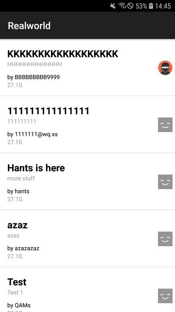

# 

> ### [Appcelerator Titanium](http://appcelerator.com) codebase containing real world examples that adheres to the [RealWorld](https://github.com/gothinkster/realworld) spec and API.

### [RealWorld](https://github.com/gothinkster/realworld)

This codebase was created to demonstrate a fully fledged fullstack application built with **Appcelerator Titanium**.

For more information on how to this works with other frontends/backends, head over to the [RealWorld](https://github.com/gothinkster/realworld) repo.

### Screenshots

Current look 
  
<i>(very early demo version)</i>
